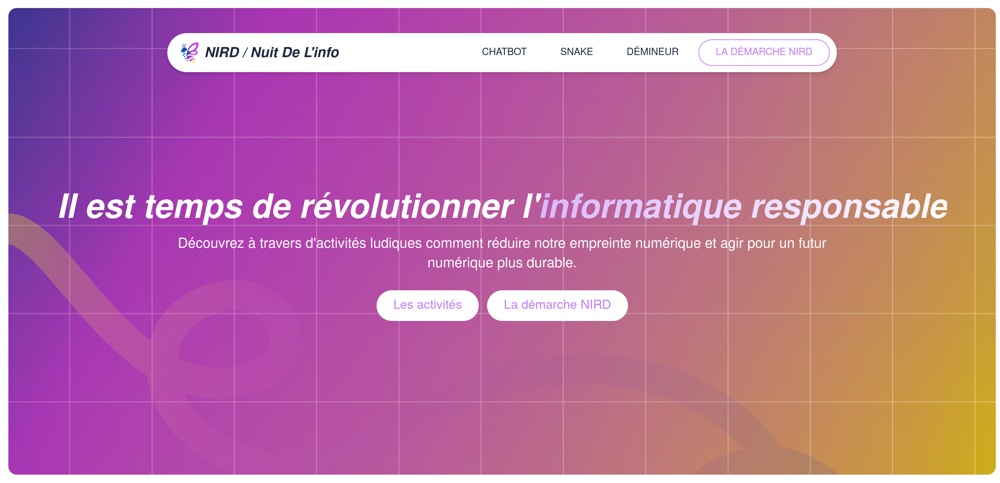

<h1 align="center">Nuit de l'info 2025</h1>
<h4 align="center">Adrien JAYAT, Erwan COUBRET, Nathan WURPILLOT, Ryan BELAIB Antoine BRETZNER</h4>

 &nbsp;


## Environment

To run the application, you need to set up the environment variables. Create a `.env` file in the fastapi directory of the project and add the following variables:

```py
GROQ_API_KEY="your-api-key"
```

## Easy Setup with Docker

Docker can be used to run the backend, the frontend, and the database in isolated containers. You need to install [Docker](https://docs.docker.com/get-docker/) on your system.

Then start the Docker containers with the following command:

```bash
docker compose up
```

## Presentation

You can find the site at [https://ndi2025.hixy.tk](https://ndi2025.hixy.tk)



## Dependencies

### Backend

The API is built using [FastAPI](https://fastapi.tiangolo.com/), you need to install [Python 3.11](https://www.python.org/downloads/release/python-31112/) or more.

#### Using uv

Install [uv](https://docs.astral.sh/uv/) with `pip install uv`.

Then, make sure you are in the `fastapi/` directory and run the following command to install dependencies:

```bash
uv sync
```

### Frontend

Install [Node.js](https://nodejs.org/en/download/) and [npm](https://www.npmjs.com/get-npm) (comes with Node.js).

You can start the frontend with the following command:

```bash
pnpm dev --port 3001
```
